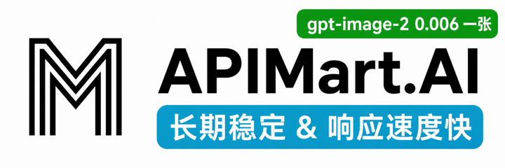

<h1 align="center">YOLO</h1>

  Asistente de IA nativo de agentes para Obsidian: chat, escritura, base de conocimiento y orquestación, todo en un solo lugar.

  
  
  
  

  <a href="./README.md">English</a> | <a href="./README_zh-CN.md">简体中文</a> | <a href="./README_it.md">Italiano</a> | <b>Español</b>

  

## Sponsors

<table>
<tr>
<td width="200" align="center" valign="middle">
  <a href="https://www.atlascloud.ai/?utm_source=github&utm_medium=link&utm_campaign=obsidian-yolo">
    <picture>
      <source media="(prefers-color-scheme: dark)" srcset="https://www.atlascloud.ai/logo-white.svg">
      
    </picture>
  </a>
</td>
<td valign="middle">
  <b><a href="https://www.atlascloud.ai/?utm_source=github&utm_medium=link&utm_campaign=obsidian-yolo">Atlas Cloud</a></b> ofrece a los desarrolladores una API unificada para crear con IA de lenguaje, imagen y vídeo. Una sola integración permite explorar más de 300 modelos seleccionados para todas las modalidades, sin tener que mantener conexiones separadas con cada proveedor. Desde agentes basados en LLM hasta generación de imágenes y vídeo, Atlas Cloud facilita la experimentación, la comparación de modelos y la incorporación de IA multimodal a producción.
    
  <a href="https://www.atlascloud.ai/?utm_source=github&utm_medium=link&utm_campaign=obsidian-yolo"><b>Explora Atlas Cloud →</b></a>
  &nbsp;&nbsp;·&nbsp;&nbsp;
  <a href="https://www.atlascloud.ai/console/coding-plan"><b>Descubre el Coding Plan →</b></a>
</td>
</tr>
<tr>
<td width="200" align="center" valign="middle">
  
</td>
<td valign="middle">
  ¡Gracias a <b><a href="https://go.apimart.ai/gh-obsidian-yolo">APIMart</a></b> por patrocinar este proyecto! APIMart es una plataforma de API de bajo coste para generación de imagen y vídeo con IA: GPT-Image-2 desde 0,006 $ por imagen, más de 160 imágenes por dólar. Una única API asíncrona cubre imagen y vídeo: envías la tarea, recibes un ID y recuperas el resultado por sondeo o callback. Procesa decenas de miles de imágenes por lotes sin timeouts y cambia de modelo sin tocar el código. Pago por uso y sin cuota mensual: regístrate aquí para empezar.
    
  <a href="https://go.apimart.ai/gh-obsidian-yolo"><b>Regístrate en APIMart →</b></a>
</td>
</tr>
</table>

## Novedades

- **`1.6`**
  - **Modelos de embedding locales on-device y múltiples bases de conocimiento**: indexa sin ninguna clave API, divide y gestiona las bases de conocimiento de forma independiente, y deja que el Agente elija automáticamente la correcta por su nombre.
  - **Chat por CLI**: en escritorio puedes controlar desde la misma interfaz de chat el Claude Code, Codex, Hermes o Pi CLI con el que ya has iniciado sesión.
  - **El nuevo Modo de Aprendizaje**: convierte cualquier tema y material de referencia en un proyecto de aprendizaje personalizado con esquemas estructurados, puntos de conocimiento, tarjetas de estudio y un mapa de conocimiento interactivo, respaldado por la repetición espaciada FSRS y la importación de `.apkg` de Anki para un repaso sostenible a largo plazo.

- **`1.5`**: Presenta un nuevo runtime de Agente que convierte la IA de simples preguntas y respuestas en colaboración activa, con llamada completa a herramientas, MCP, Skills, Bash de escritorio, subagentes y búsqueda web, además de un contexto y una memoria más inteligentes para sesiones largas, RAG híbrido renovado, reconocimiento de foco/PDF y chat multiventana con Agentes en segundo plano.

## Lo más destacado

<table>
<tr>
<td width="50%" align="center"><b>Una experiencia de Agente completa | Usa Codex / Claude Code dentro de Obsidian</b></td>
<td width="50%" align="center"><b>Convierte el conocimiento de tu Vault en dominio duradero</b></td>
</tr>
<tr valign="top">
<td align="center"></td>
<td align="center"></td>
</tr>
<tr valign="top">
<td align="center">Ve más allá de las respuestas. YOLO entiende y trabaja directamente con tu Vault, llama a herramientas y servidores MCP, y usa Skills para hacer trabajo real a tu manera. En escritorio puedes cambiar con un clic al Claude Code o Codex con el que ya has iniciado sesión y dejar que trabajen directamente en tu Vault.</td>
<td align="center">Convierte temas y material de origen en un sistema de aprendizaje personal, y luego usa tarjetas y el repaso con FSRS para pasar de notas guardadas a conocimiento duradero.</td>
</tr>
<tr>
<td colspan="2" align="center"><b>YOLO Whiteboard | Una implementación de alto rendimiento de Obsidian Canvas</b></td>
</tr>
<tr>
<td colspan="2" align="center"></td>
</tr>
<tr>
<td colspan="2" align="center">Por ahora, piénsalo como un Obsidian Canvas de varias a decenas de veces más rápido. Pronto llegarán más funciones que amplían las fronteras entre la IA y el pensamiento humano.</td>
</tr>
</table>

## Funciones

Además de las capacidades principales anteriores, YOLO también ofrece:

| Función | Descripción |
|---------|-------------|
| 🖥️ Agente CLI (escritorio) | Reutiliza el Claude Code / Codex con el que ya has iniciado sesión en tu equipo y conversa con el agente CLI dentro de Obsidian |
| 🔌 Soporte de agentes externos | Conecta clientes MCP como Hermes y OpenClaw a la búsqueda en el Vault de YOLO, o delega tareas a un Agente YOLO configurado |
| ⚡ Quick Ask | Pregunta, edita y continúa escribiendo sin salir del editor |
| 🔎 RAG del Vault | Recupera información en todo tu Vault para obtener respuestas basadas en tus propias notas |
| 🪟 Chat multiventana | Ejecuta distintas tareas y contextos en paralelo en ventanas de chat independientes |
| 🧠 Sistema de memoria | Permite que YOLO recuerde preferencias, hábitos y contexto a largo plazo para conversaciones más coherentes |
| 🪡 Cursor Chat | Añade contexto con un clic, la conversación al alcance de tu mano |
| ⌨️ Autocompletado con Tab | Autocompletado en tiempo real con IA para una escritura más fluida y natural |
| 🎛️ Soporte multimodelo | OpenAI, Claude, Gemini, DeepSeek y otros modelos populares, cambia libremente |
| 🌍 i18n | Soporte multilingüe nativo |

## Inicio rápido

1. Abre los Ajustes de Obsidian → Complementos de la comunidad → Explorar → Busca **"YOLO"**
2. Instálalo y actívalo
3. Configura tu clave de API en los ajustes del complemento, o usa tu propio ChatGPT OAuth / Gemini OAuth:
   - [OpenAI](https://platform.openai.com/api-keys) / [Anthropic](https://console.anthropic.com/settings/keys) / [Gemini](https://aistudio.google.com/apikey) / [Groq](https://console.groq.com/keys)
4. Abre la barra lateral para empezar a chatear, o prueba Quick Ask escribiendo `@` en el editor

## Instalación

### Tienda de complementos de la comunidad (recomendado)

Consulta el Inicio rápido más arriba.

### Instalación manual

1. Ve a [Releases](https://github.com/Lapis0x0/obsidian-yolo/releases) y descarga los últimos `main.js`, `manifest.json`, `styles.css`
2. Crea la carpeta: `<vault>/.obsidian/plugins/obsidian-yolo/`
3. Copia los archivos en esa carpeta y luego activa el complemento en los Ajustes de Obsidian

> [!WARNING]
> YOLO no puede coexistir con [Smart Composer](https://github.com/glowingjade/obsidian-smart-composer). Desactiva o desinstala Smart Composer antes de usar YOLO.

## Hoja de ruta

- [x] Búsqueda con IA en el Vault mejorada y más potente
- [x] Agente en segundo plano (automatización de tareas de larga duración)
- [x] Orquestación multiagente (mediante subagentes)
- [x] Modo de Aprendizaje — una vista de estudio dedicada
- [ ] Modo de Anotación — anotaciones y sugerencias de IA en tiempo real sobre las notas
- [ ] Asistente integrado — un ayudante fijado en una esquina para configuración/agentes, con compactación automática y tareas programadas
- [ ] Mejor pizarra con IA
- [ ] Entrada de voz y notas de reuniones

## Comentarios y problemas

¿Encontraste un error, algo confuso o tienes una idea? Abre un issue:

🐛 [Reportar un error](https://github.com/Lapis0x0/obsidian-yolo/issues/new?template=bug_report.yml) · ✨ [Solicitar una función](https://github.com/Lapis0x0/obsidian-yolo/issues/new?template=feature_request.yml)

Lo que ayuda:

- Reportes de errores con una reproducción clara (versión de Obsidian, sistema operativo, versión del complemento, qué hiciste y qué ocurrió)
- Reportes del tipo "probé X y obtuve Y": fricciones de UX, textos confusos, documentación rota, traducciones desactualizadas
- Ideas de funciones concretas ligadas a un caso de uso real ("cuando hago A, quiero B porque C")

Busca primero en los issues existentes para evitar duplicados.

## Contribuir

Toda forma de contribución es bienvenida: reportes de errores, mejoras en la documentación, mejoras de funciones.

**Abre primero un issue para discutir la viabilidad y la implementación de funciones importantes.**

Consulta [CONTRIBUTING.md](./CONTRIBUTING.md) para la guía completa: qué aceptamos, la política de PR asistidos por IA, las pautas de tamaño y la configuración de desarrollo.

## Agradecimientos

Gracias a [Smart Composer](https://github.com/glowingjade/obsidian-smart-composer) por el trabajo original: sin ellos, YOLO no existiría.

Un agradecimiento especial a [Kilo Code](https://kilo.ai) por su patrocinio. Kilo es una plataforma de asistente de codificación con IA de código abierto con más de 500 modelos de IA, que ayuda a los desarrolladores a construir e iterar más rápido.

  

## Apoyo

Si YOLO te resulta valioso, considera apoyar el proyecto:

  
  &nbsp;
  
  &nbsp;
  

Los registros de desarrollo se actualizan regularmente en el [blog](https://www.lapis.cafe).

## Licencia

[Licencia MIT](LICENSE)

## Historial de estrellas

